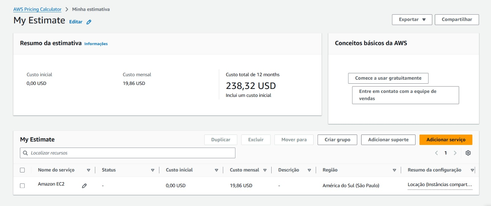
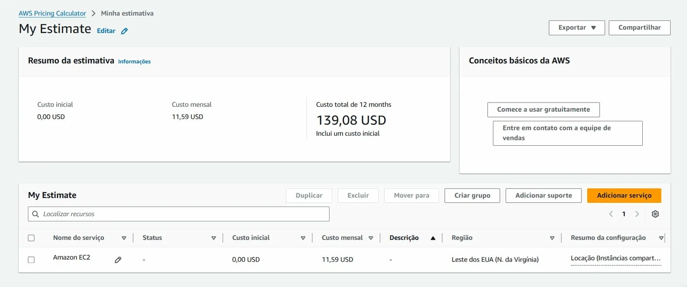

# FarmTech Solutions — Crop Yield Prediction

Sistema de Machine Learning para previsão de rendimento de safra com base em dados climáticos e de solo, desenvolvido para otimizar decisões agrícolas em fazendas de grande escala.

---

## Notebook

Todo o desenvolvimento, código comentado, análises e conclusões estão no notebook abaixo:

👉 [Acessar o Notebook Completo](https://github.com/Pedro-Zanon/FarmTech-Solutions-Fase-5/blob/main/notebook/PBL_FarmTech_Fase5%20(2).ipynb)

---

## Vídeos Demonstrativos

- 📹 Vídeo 1 — Machine Learning: *(https://www.youtube.com/watch?v=ahFJQGES_18)*
- 📹 Vídeo 2 — AWS: *(https://youtu.be/Ipf548WU-JM)*

---

## Sumário

- [Sobre o Projeto](#sobre-o-projeto)
- [Dataset](#dataset)
- [Pipeline de Machine Learning](#pipeline-de-machine-learning)
- [Resultados](#resultados)
- [Infraestrutura em Nuvem](#infraestrutura-em-nuvem)
- [Como Executar](#como-executar)
- [Tecnologias](#tecnologias)
- [Estrutura do Repositório](#estrutura-do-repositório)

---

## Sobre o Projeto

A FarmTech Solutions opera com sensores distribuídos em uma fazenda de **200 hectares**, coletando dados climáticos em tempo real. O objetivo deste projeto é transformar esses dados em previsões de rendimento por cultura — permitindo decisões mais assertivas sobre plantio, manejo e logística.

O projeto cobre três frentes:

1. **Análise exploratória** dos dados climáticos e de produtividade
2. **Clusterização** para identificar padrões e segmentar condições de cultivo
3. **Modelagem preditiva** com comparação de múltiplos algoritmos de regressão

---

## Dataset

**Arquivo:** `data/crop_yield.csv` — 156 amostras, sem valores ausentes ou duplicatas.

### Variáveis

| Coluna | Tipo | Descrição |
|---|---|---|
| `Crop` | Categórico | Tipo de cultura (`Oil palm fruit`, `Rice, paddy`, `Cocoa, beans`, `Rubber, natural`) |
| `Precipitation (mm day⁻¹)` | Float | Precipitação média diária |
| `Specific Humidity at 2 Meters (g/kg)` | Float | Umidade específica a 2m do solo |
| `Relative Humidity at 2 Meters (%)` | Float | Umidade relativa do ar a 2m |
| `Temperature at 2 Meters (°C)` | Float | Temperatura média a 2m do solo |
| `Yield` | Inteiro | Rendimento da safra (unidades/hectare) |

### Distribuição dos dados

| Variável | Mínimo | Máximo |
|---|---|---|
| Precipitação | 1.934 mm | 3.085 mm |
| Umidade Específica | 17,54 g/kg | 18,70 g/kg |
| Umidade Relativa | 82,11% | 86,10% |
| Temperatura | 25,56°C | 26,81°C |
| Rendimento (Yield) | 5.249 | 203.399 |

---

## Pipeline de Machine Learning

### Análise Exploratória (EDA)

- Inspeção da estrutura do dataset: shape, tipos e integridade dos dados
- Histogramas com curvas KDE para visualizar a distribuição de cada variável
- Mapa de calor de correlações entre variáveis numéricas
- Comparação do rendimento médio por cultura com boxplots e violin plots

**Principais achados:**
- As variáveis climáticas têm baixa variância entre si — o dataset opera em uma faixa climática estreita
- `Oil palm fruit` domina o rendimento com valores até 203.399 unidades/ha, muito acima das demais culturas
- A correlação das variáveis climáticas com o rendimento é fraca de forma isolada — **o tipo de cultura é o fator determinante**

---

### Clusterização com K-Means

- Normalização com `StandardScaler`
- Método do Cotovelo para definir `k=4` como número ideal de clusters
- Aplicação do K-Means e interpretação das características de cada grupo
- Detecção de outliers via Silhouette Score e distância ao centroide

**Resultado:** O Cluster 0 é dominado por `Oil palm fruit` e concentra os maiores rendimentos. Os demais clusters separam as outras culturas por faixas de precipitação e umidade.

---

### Modelos Preditivos de Regressão

**Divisão dos dados:** 80% treino (124 amostras) / 20% teste (32 amostras)

Foram treinados e comparados 6 algoritmos:

| # | Modelo |
|---|---|
| 1 | Regressão Linear |
| 2 | Ridge Regression |
| 3 | Árvore de Decisão |
| 4 | Random Forest |
| 5 | Gradient Boosting |
| 6 | Support Vector Regression (SVR) |

Avaliação com três métricas: **R²**, **MAE** e **RMSE**.

---

## Resultados

| Modelo | R² Score | MAE | RMSE |
|---|---|---|---|
| **Random Forest** | **0,9944** | **2.748** | **4.640** |
| Árvore de Decisão | 0,9936 | 3.059 | 4.967 |
| Gradient Boosting | 0,9931 | 3.058 | 5.181 |
| SVR | 0,3567 | 30.163 | 49.954 |
| Ridge | -0,0657 | 53.322 | 64.295 |
| Regressão Linear | -0,1015 | 53.725 | 65.365 |

**Modelo selecionado: Random Forest** com R² de 0,9944 — explica 99,44% da variância do rendimento.

### Por que modelos lineares falharam?

O rendimento é determinado principalmente pelo tipo de cultura — uma variável categórica com separação não-linear. Modelos lineares (Ridge, Regressão Linear) não conseguem capturar esse padrão e retornam R² negativo. Árvores de decisão lidam naturalmente com esse comportamento.

O SVR apresentou desempenho mediano (R² = 0,36) — melhor que os lineares, mas muito inferior às árvores.

---

## Infraestrutura em Nuvem

Para hospedar a API com o modelo treinado, foram comparadas duas regiões AWS usando instâncias **EC2 t3.micro** (2 vCPUs, 1 GiB RAM, 50 GB de armazenamento, Linux On-Demand).

### Comparação de Custos

| Região | Código | Custo Mensal |
|---|---|---|
| São Paulo | `sa-east-1` | $19,86 USD |
| Virgínia do Norte | `us-east-1` | $11,59 USD |

Prints das cotações:

| São Paulo | Virgínia do Norte |
|---|---|
|  |  |

### Por que São Paulo?

Apesar de custar ~71% a mais, a região `sa-east-1` é a escolha adequada por dois motivos:

**LGPD:** Os dados coletados pelos sensores são de origem brasileira. Hospedar o processamento em território nacional elimina riscos legais relacionados à transferência internacional de dados sob a Lei Geral de Proteção de Dados (Lei nº 13.709/2018).

**Latência:** Os sensores estão fisicamente no Brasil. A região de Virgínia fica a ~7.000 km de distância, o que aumenta a latência e reduz a confiabilidade no envio de dados em tempo real. São Paulo mantém a comunicação rápida e estável.

---

## Como Executar

```bash
# Clone o repositório
git clone <url-do-repositorio>
cd FarmTech-Solutions-Fase-5

# Crie e ative um ambiente virtual
python -m venv .venv
source .venv/bin/activate        # Linux/macOS
.venv\Scripts\activate           # Windows

# Instale as dependências
pip install -r requirements.txt

# Configure as variáveis de ambiente
cp .env.example .env

# Abra o notebook
jupyter notebook notebook/PEDROZANONCASTROSANTANA_rm567350_pbl_fase4.ipynb
```

---

## Tecnologias

| Pacote | Uso |
|---|---|
| `pandas` | Manipulação e análise do dataset |
| `numpy` | Operações numéricas |
| `scikit-learn` | Algoritmos de ML, normalização e métricas |
| `matplotlib` / `seaborn` | Visualizações e gráficos estatísticos |
| `joblib` | Serialização e exportação dos modelos treinados |
| `python-dotenv` | Gerenciamento de variáveis de ambiente |
| `jupyter` | Ambiente de notebook interativo |

---

## Estrutura do Repositório

```
FarmTech-Solutions-Fase-5/
│
├── data/
│   └── crop_yield.csv                          # Dataset com dados das plantações
│
├── notebook/
│   ├── PEDROZANONCASTROSANTANA_rm567350_pbl_fase4.ipynb  # Notebook principal
│   └── models/                                 # Modelos exportados como .pkl
│
├── aws/
│   ├── prints_sao_paulo/
│   │   └── cotacao_sao_paulo.png
│   └── prints_virginia/
│       └── cotacao_virginia.png
│
├── .env.example
├── .gitignore
├── requirements.txt
└── README.md
```
